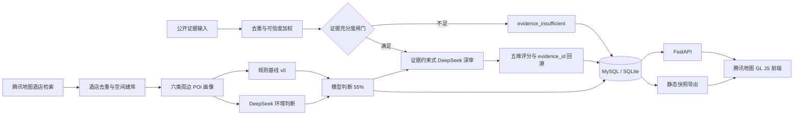

# 壳里 · 女性安全地图

壳里把酒店位置、周边环境、公开安全证据、模型置信度和房间检查结果组织成一套可解释、可回溯的空间安全判断系统。地图是结果入口，核心是“酒店空间建库 → 环境画像 → 规则基线 → DeepSeek 环境初评 → 公开证据结构化 → 约束式深度审计 → 分层展示”。

本仓库同时包含：可直接打开的地图前端、三座城市的脱敏数据快照、FastAPI 主后端、SQLAlchemy 数据模型、腾讯地图采集任务、DeepSeek 两层评估、房间检查存储接口、数据导入导出脚本和测试。

> 安全评分用于辅助筛选，不代表绝对安全，不替代入住前的现场判断、官方信息和紧急求助渠道。“待补充”表示尚无足够信息，不等于低风险或高风险。

## 系统架构



两层结果不会混为一种确定程度：

- `environment_scored`：仅依据周边地图环境，规则基线占 45%，DeepSeek 判断占 55%。
- `deep_audited`：基于公开证据、来源权重、环境画像和五个固定维度形成综合审计。
- `evidence_insufficient`：已执行深审，但证据未达到闸门；深审分保持为空，已有环境分不会被覆盖。
- `pending`：只完成酒店基础收录，尚未形成评分。

## 仓库结构

| 路径 | 作用 |
| --- | --- |
| `index.html` | 腾讯地图 GL JS 前端，支持城市切换、筛选、搜索、详情、证据和环境初评 |
| `backend/app/main.py` | FastAPI 应用入口、CORS、静态前端和数据目录挂载 |
| `backend/app/models.py` | 7 张业务表的 SQLAlchemy 模型 |
| `backend/app/routes.py` | 地图查询、环境初评、城市建库、深审和房间报告 API |
| `backend/app/services/environment.py` | 规则基线 v0、POI 画像、覆盖度和 45%/55% 融合 |
| `backend/app/services/tencent_maps.py` | 腾讯地图酒店发现与六类周边 POI 检索 |
| `backend/app/services/evidence.py` | 证据去重、来源权重和充分度闸门 |
| `backend/app/services/audit.py` | 五维深审校验、事务写入、历史快照和环境分保护 |
| `backend/app/services/deepseek.py` | DeepSeek JSON 模式调用，密钥只保留在服务端 |
| `backend/scripts/` | 建库、城市批处理、快照导入和快照导出 |
| `api/`、`lib/` | 兼容 Vercel 的轻量环境初评函数及其共享规则实现 |
| `data/` | 上海、贵阳、西双版纳的静态地图和详情快照 |
| `backend/tests/`、`test/` | Python 主后端与 Node Serverless 适配层测试 |

## 快速启动

### 方式一：直接查看静态作品集

```bash
python3 -m http.server 8080
```

访问 `http://localhost:8080`。仓库内的 `runtime-config.js` 会启用 `data/` 快照模式，不需要数据库或模型密钥；实时 DeepSeek 初评不可用。

### 方式二：SQLite + 完整 FastAPI

需要 Python 3.9+。

```bash
python3 -m venv .venv
source .venv/bin/activate
pip install -r requirements.txt
cp .env.example .env
python -m backend.scripts.init_db
python -m backend.scripts.import_snapshot
uvicorn backend.app.main:app --reload
```

访问：

- 地图：`http://127.0.0.1:8000`
- OpenAPI：`http://127.0.0.1:8000/docs`
- 健康检查：`http://127.0.0.1:8000/health`

FastAPI 会提供 `runtime-config.js`，让同一份前端自动从静态快照切换为数据库 API；不需要手工修改 `index.html`。

### 方式三：Docker + MySQL

```bash
cp .env.example .env
# 在 .env 中填写 DEEPSEEK_API_KEY、TENCENT_MAP_KEY 和 ADMIN_TOKEN
docker compose up --build
```

Compose 会启动 MySQL 8.4 和 FastAPI。首次启动由 SQLAlchemy 创建表；已有静态数据可在 API 容器内执行：

```bash
docker compose exec api python -m backend.scripts.import_snapshot
```

## 配置

| 环境变量 | 必填 | 说明 |
| --- | --- | --- |
| `DATABASE_URL` | 否 | 默认 `sqlite:///./data/keli.db`；生产使用 `mysql+pymysql://...` |
| `DEEPSEEK_API_KEY` | 实时评分必填 | 只在服务端读取 |
| `DEEPSEEK_BASE_URL` | 否 | 默认 `https://api.deepseek.com` |
| `DEEPSEEK_MODEL` | 否 | 默认 `deepseek-v4-pro`，可按账号可用模型调整 |
| `TENCENT_MAP_KEY` | 城市建库必填 | 腾讯地图 WebService Key |
| `ADMIN_TOKEN` | 生产必填 | 保护 `/api/admin/*` 写入任务；通过 `X-Admin-Token` 传入 |
| `ALLOWED_ORIGINS` | 跨域部署必填 | 逗号分隔的前端来源 |
| `MAP_RADIUS_METERS` | 否 | 周边画像半径，默认 3000 米 |
| `POI_LIMIT_PER_CATEGORY` | 否 | 每类最多保留 12 个点位 |

当前主数据链路是阿里云环境中的 MySQL，代码通过 SQLAlchemy 和 `DATABASE_URL` 连接；未配置时回退到本地 SQLite。Supabase 只属于早期原型，不是本仓库当前生产依赖。房间照片二进制文件应存入阿里云 OSS 等对象存储，MySQL 的 `room_photos` 只保存 URL、对象键、检查项和状态。

## 数据库模型

| 表 | 用途 | 关键字段 |
| --- | --- | --- |
| `hotels` | 地图查询与当前状态主表 | 地图 POI ID、去重键、坐标、环境分、安全分、风险、审计状态、置信度 |
| `hotel_environment_pois` | 周边原始环境点位 | `hotel_id`、类别、距离、坐标、来源 POI ID |
| `hotel_evidence_items` | 深审公开证据 | `evidence_id`、来源、链接、时间、claim、风险类型、可信度权重 |
| `hotel_safety_dimensions` | 五维评分与理由 | dimension、score、weight、reason、`evidence_ids` |
| `room_photos` | 一次房间检查的照片元数据 | `uid + request_id`、对象 URL/Key、检查项和状态 |
| `room_reports` | 房间检查结构化报告 | `uid + request_id`、风险、issues、suggestions、完整 JSON |
| `audit_history` | 每次评估的不可变快照 | 审计类型、模型/规则版本、阈值、分数、置信度、结果 JSON |

所有环境初评和深审都会写入 `audit_history`。成功深审会在同一数据库事务中替换证据明细与维度评分，并更新酒店主表；结构校验失败会回滚，不产生半成品结果。

## 规则基线 v0

每家酒店从中性分 `2.5` 开始，按最近 POI 的 0–300 米、300–800 米、800–1500 米三档调整：

| 类别 | ≤300m | ≤800m | ≤1500m |
| --- | ---: | ---: | ---: |
| 公安设施 | +0.62 | +0.42 | +0.20 |
| 医疗设施 | +0.42 | +0.28 | +0.12 |
| 公共交通 | +0.28 | +0.18 | +0.08 |
| 生活配套 | +0.22 | +0.14 | +0.06 |
| 夜生活场所 | −0.52 | −0.34 | −0.14 |
| 道路与偏僻风险 | −0.68 | −0.44 | −0.20 |

另有四项密度修正：800 米内夜生活 ≥4 个 `−0.18`；道路风险 ≥2 个 `−0.20`；1500 米内公安设施 ≥2 个 `+0.10`；800 米内公共交通 ≥2 个 `+0.08`。规则分限制在 `0.5–4.8`，最终环境分为 `规则 × 45% + DeepSeek × 55%`，置信度取模型置信度与 POI 覆盖度中的较低值。

这些参数是公测工程基线，不是官方犯罪率模型或行业标准。实现集中在 `backend/app/services/environment.py` 和 `lib/environment-assessment.js`，两端测试用于防止规则漂移。

## 深度审计

深审请求只接收已经采集、可核验的公开证据，不允许模型自行联网补写事实。证据会先按 URL/claim 去重，再根据来源类型、链接和时间线索计算权重。

当前最低闸门：有效证据不少于 2 条、独立来源不少于 2 个、至少 1 个可访问链接、加权总量不低于 1.2。通过后，DeepSeek 必须返回五个固定维度：

| 维度 | 权重 |
| --- | ---: |
| 酒店自身安全 | 35% |
| 住客安全反馈 | 30% |
| 周边环境 | 20% |
| 消防卫生与管理 | 10% |
| 数据充分度 | 5% |

服务端不接受模型直接给出的总分，而是校验五个维度、检查每个判断的 `evidence_id`，再按固定权重计算总分。如果证据不足，`score` 返回 `null`，状态写为 `evidence_insufficient`，已有 `environment_score` 继续用于地图展示。

示例：

```bash
curl -X POST 'http://127.0.0.1:8000/api/admin/hotels/1/audit' \
  -H 'Content-Type: application/json' \
  -H 'X-Admin-Token: your-admin-token' \
  -d '{
    "evidence": [
      {
        "platform": "官方公开来源",
        "source_type": "official",
        "title": "检查通报",
        "url": "https://example.gov.cn/notice/1",
        "published_at": "2026-08-01",
        "claim": "公开通报中与该酒店直接相关的可核验事实。",
        "risk_type": "消防管理",
        "sentiment": "negative"
      },
      {
        "platform": "OTA",
        "source_type": "ota",
        "title": "近期住客评价",
        "url": "https://example.com/review/2",
        "published_at": "2026-08-02",
        "claim": "近期住客对门锁与夜间入口给出的具体描述。",
        "risk_type": "门锁",
        "sentiment": "neutral"
      }
    ]
  }'
```

## 城市建库与批处理

按城市和多组住宿关键词发现酒店，优先以腾讯地图 POI ID 去重；没有 POI ID 时使用标准化的“酒店名 + 地址”哈希。

```bash
python -m backend.scripts.build_city \
  --city-name 上海 \
  --city-code 310000 \
  --max-pages 3 \
  --environment-limit 20
```

`--environment-limit 0` 只建酒店基础库；大于 0 时会为指定数量的待处理酒店采集六类 POI 并调用 DeepSeek 生成环境初评。批任务按酒店隔离失败，单家失败不会中断整座城市。

数据库与静态作品集之间可双向转换：

```bash
python -m backend.scripts.import_snapshot
python -m backend.scripts.export_snapshot
```

导出脚本会重建 `data/cities.json`、`data/hotels-*.json`、`data/details/*.json` 和 `data/snapshot.json`，用于 GitHub Pages 等纯静态托管。

## 主要 API

| 方法 | 路径 | 说明 |
| --- | --- | --- |
| GET | `/api/cities` | 城市列表与酒店数量 |
| GET | `/api/hotels?city_code=310000` | 地图酒店列表，可按状态和名称筛选 |
| GET | `/api/hotels/{id}` | 酒店、证据、环境 POI 和维度详情 |
| POST | `/api/environment-assessment` | 不落库的实时规则 + DeepSeek 环境初评 |
| POST | `/api/admin/cities/discover` | 腾讯地图城市建库 |
| POST | `/api/admin/hotels/{id}/environment` | 刷新 POI 并持久化环境初评 |
| POST | `/api/admin/hotels/{id}/audit` | 证据闸门与持久化深度审计 |
| PUT | `/api/room-reports/{request_id}` | 按 `uid + request_id` 写入房间报告和照片元数据，要求 `X-User-ID` |
| GET | `/api/room-reports/{request_id}` | 读取当前用户的房间报告，要求 `X-User-ID` |

精确请求/返回结构以启动后的 `/docs` 为准。

## 测试

```bash
npm test
.venv/bin/python -m pytest backend/tests -q
```

Node 测试覆盖 Vercel 环境初评函数；Python 测试覆盖规则基线、分档、证据去重/加权/闸门、固定维度计算、证据不足时保留环境分、数据库接口和房间报告隔离。

## 部署和安全边界

- 不要把 `.env`、DeepSeek Key、腾讯地图 Key 或数据库密码提交到仓库。
- 公开部署必须设置 `ADMIN_TOKEN`，并在网关层为实时模型接口增加鉴权、速率限制、请求日志脱敏和费用告警。
- `X-User-ID` 目前是业务隔离接口，不是完整身份认证；正式部署必须由可信鉴权网关从登录态注入，不能接受浏览器任意传值。
- 公开证据必须遵守来源平台条款、版权和隐私要求；数据库保存结构化 claim、来源和必要摘要，不应无边界复制原文。
- 照片二进制文件应存放在私有对象存储并使用短期签名 URL；数据库只保存元数据。

技术口径对应[壳里技术文档](https://my.feishu.cn/docx/TrSWddS1DoZ9scx8n50c8XDMnue)。
